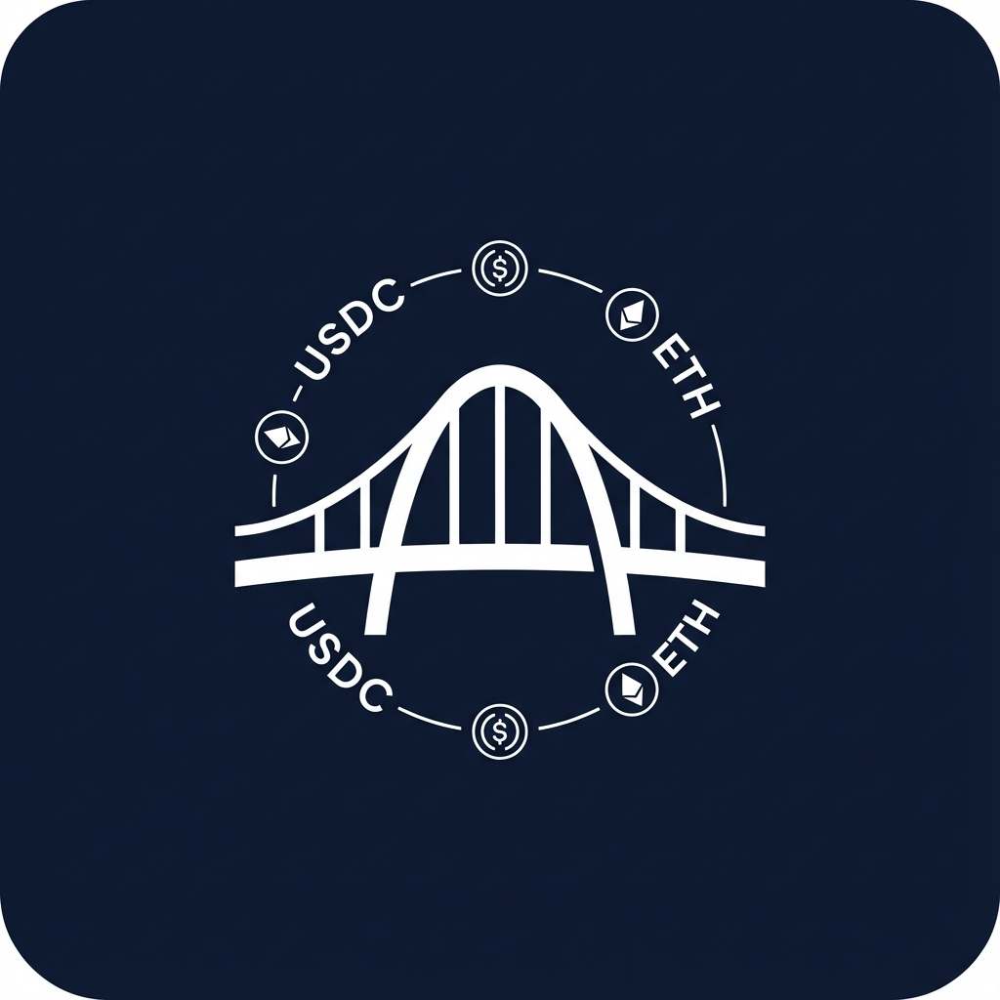

# ARC - Multichain Bridge

A modern, secure, and user-friendly cross-chain bridge application built on Arc Testnet. Seamlessly transfer USDC between **Arc Testnet** and 10+ other testnet chains including Sepolia, Base, Arbitrum, Optimism, Polygon, Avalanche, and more.



## 🚀 Live Demo
[https://arc-multichain-app.vercel.app](https://arc-multichain-app.vercel.app)

## ✨ Key Features

-   **Multi-Chain Support**: Bridge USDC between Arc Testnet and 10+ supported testnets.
-   **Bidirectional Bridging**: Seamlessly transfer assets to and from Arc Testnet.
-   **Smart Wallet Switching**: Automatically prompts users to switch networks.
-   **Real-time Status**: Live tracking of bridge steps (Approval -> Transfer -> Receive).
-   **Dark Mode**: Fully responsive dark/light theme.
-   **Dynamic UI**: Context-aware faucet links and explorer buttons.

## 🔗 Supported Chains

-   **Arc Testnet** (Hub)
-   Ethereum Sepolia
-   Base Sepolia
-   Arbitrum Sepolia
-   Optimism Sepolia
-   Polygon Amoy
-   Avalanche Fuji
-   Unichain Sepolia
-   World Chain Sepolia
-   Ink Sepolia
-   Linea Sepolia

## 🛠️ Tech Stack

-   **Frontend**: React, Vite, TypeScript, Tailwind CSS
-   **Web3**: Wagmi, Viem, RainbowKit
-   **Bridging**: Circle Bridge Kit (CCTP)
-   **Deployment**: Vercel

## 📦 Installation

1.  **Clone the repository**
    ```bash
    git clone https://github.com/ayberkesn/arc-multichain-bridge.git
    cd arc-multichain-bridge
    ```

2.  **Install dependencies**
    ```bash
    npm install
    ```

3.  **Start development server**
    ```bash
    npm run dev
    ```

## 📝 License

MIT

---

Built with ❤️ on Arc Testnet
